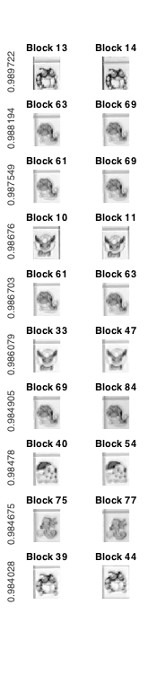

# 连连看综合实验

* 无 36
* 李思涵
* 2013011187

## 原创性声明

此实验的代码 & 实验报告均为原创。


## 第一章 制作自己的连连看

### 1.1 熟悉游戏

嗯嗯背景里面的两只皮卡丘好萌哇😊

### 1.2 实现判断是否可消除的功能

首先，我们来判断直线连接的情况，即0个转折的情况。

这种情况很容易判断，只需要判断两个块是否在同一条直线上，同时其间的块都是0。代码实现如下：

```matlab
%% zero_turn: Judge whether two blocks have only spaces in between.
function bool = zero_turn(mtx, x1, y1, x2, y2)
    left = min(x1, x2);
    right = max(x1, x2);
    down = min(y1, y2);
    up = max(y1, y2);

    bool = (x1 == x2 && all(mtx(x1, down+1:up-1) == 0) || ...
            y1 == y2 && all(mtx(left+1:right-1, y1) == 0));
end
```

然后，我们来判断拐弯连，即1个转折的情况。

通过观察我们不难发现，这种情况中的连线，实际上就是以两个块为顶点的矩形的两条相邻边，而这样的可能连接有两条。对于两条中的某一条，都可以用如下情况判断：

1. 确定转折点的坐标；
2. 判断转折点和两个两个块之间，以及转折点本身是否都为空。

具体代码实现如下，注意到这里我们调用了 `zero_turn` 来进行一部分判断，从而避免了在这里判断两个块的相对位置。

```matlab
%% one_turn: Judge whether two blocks can be linked in one turn.
function bool = one_turn(mtx, x1, y1, x2, y2)
    bool = (zero_turn(mtx, x1, y1, x2, y1) && ...
            zero_turn(mtx, x2, y1, x2, y2) && ...
            mtx(x2, y1) == 0 || ...
            zero_turn(mtx, x1, y1, x1, y2) && ...
            zero_turn(mtx, x1, y2, x2, y2) && ...
            mtx(x1, y2) == 0);
end
```

最后，我们来判断拐俩弯的情况。为了简化函数，我们假设已经排除了前两种情况。注意到这种情况中，连线可能出现在地图边界以外，我们先使用 `padarray` 将地图向外用0扩张一圈：

```matlab
%% two_turns: Assuming not zero or one turn.
function bool = two_turns(mtx, x1, y1, x2, y2)
    % Pad the matrix for the possible links.
    mtx = padarray(mtx, [1, 1]);
    x1 = x1 + 1;
    y1 = y1 + 1;
    x2 = x2 + 1;
    y2 = y2 + 1;
```

然后我们使用如下的策略来判断：

1. 从块1开始，向四个方向尽可能延伸，直到遇到非零块或边界；
2. 对于延伸的每一个块，判断其是否能与块2拐弯连，若能则说明块1能与块2拐俩弯连。

具体代码实现如下：

```matlab
    direction = [ 0  1
                  0 -1
                  1  0
                 -1  0];

    for k = 1:4
        delta = direction(k, :);
        pos = [x1 y1] + delta;

        % Toward if possible.
        while all(pos > [0 0] & pos <= size(mtx)) && mtx(pos(1), pos(2)) == 0
            if one_turn(mtx, pos(1), pos(2), x2, y2)
                bool = 1;
                return
            end
            pos = pos + delta;
        end
    end

    bool = 0;
```

最后，利用这三个函数，我们可以很简单地实现 `detect` 函数：

```matlab
function bool = detect(mtx, x1, y1, x2, y2)
    % ========================== 参数说明 ==========================

    % 输入参数中，mtx为图像块的矩阵，类似这样的格式：
    % [ 1 2 3;
    %   0 2 1;
    %   3 0 0 ]
    % 相同的数字代表相同的图案，0代表此处没有块。
    % 可以用[m, n] = size(mtx)获取行数和列数。
    % (x1, y1)与（x2, y2）为需判断的两块的下标，即判断mtx(x1, y1)与mtx(x2, y2)
    % 是否可以消去。

    % 注意mtx矩阵与游戏区域的图像不是位置对应关系。下标(x1, y1)在连连看界面中
    % 代表的是以左下角为原点建立坐标系，x轴方向第x1个，y轴方向第y1个

    % 输出参数bool = 1表示可以消去，bool = 0表示不能消去。

    %% 在下面添加你的代码O(∩_∩)O
    bool = mtx(x1, y1) == mtx(x2, y2) && ...
           (zero_turn(mtx, x1, y1, x2, y2) || ...
            one_turn(mtx, x1, y1, x2, y2) || ...
            two_turns(mtx, x1, y1, x2, y2));
end
```

最后在移走 `detect.p`，移入 `detect.m`，在游戏中测试我们的算法…成功 ↖(￣▽￣")

### 1.3 实现外挂功能

### 1.4 自由发挥

## 第二章 攻克别人的连连看

### 2.1 对屏幕截图分块

```matlab
imgs_truth = divide_img(graycapture);
show_divided_img(imgs_truth);
```


### 2.2 对摄像头采集到的图像分块

```matlab
imgs = divide_img(graygroundtruth);
show_divided_img(imgs);
```


### 2.3 计算分块相似性

为了使各个分块的纹理更加突出，我们先对每个分块进行高通滤波：

```matlab
%% highpass_img: Keep only the high-freq component of the img.
function high_freq_img = highpass_img(img, order)
    % Ensure an even order.
    if mod(order, 2)
        order = order + 1;
    end

    filter_1d = fir1(order, 0.5, 'high');
    filter_2d = zeros(order + 1);
    center = order / 2 + 1;

    for row = 1:order+1
        for col = 1:order+1
            r = round(sqrt((row - center)^2 + (col - center)^2));
            if r > center - 1
                value = 0;
            else
                value = filter_1d(center - r);
            end
            filter_2d(row, col) = value;
        end
    end

    high_freq_img = filter2(filter_2d, img);
```

然后对各对图像块之间进行匹配：

```matlab
%% match_imgs: Match images
function similarity = match_imgs(imgs, order, margin_ratio)
    img_num = numel(imgs);
    high_imgs = cell(img_num, 1);
    similarity = eye(img_num);

    margin = round(margin_ratio * size(imgs{1}));

    for k = 1:img_num
        high_imgs{k} = highpass_img(imgs{k}, order);
    end

    for k1 = 1:img_num-1
        for k2 = k1+1:img_num
            img1 = high_imgs{k1};
            img2 = high_imgs{k2};

            corr1 = max(max(normxcorr2(img1(1+margin(1):end-margin(1), ...
                                            1+margin(2):end-margin(2)), ...
                                       img2)));
            corr2 = max(max(normxcorr2(img2(1+margin(1):end-margin(1), ...
                                            1+margin(2):end-margin(2)), ...
                                       img1)));
            corr = max([corr1 corr2]);

            similarity(k1, k2) = corr;
            similarity(k2, k1) = corr;
        end
    end
```

对结果进行排序：

```matlab
%% sort_match: Sort matching result.
function [matches, values] = sort_match(similarity)
    img_num = length(similarity);

    % Remove useless elements.
    [values, index] = sort(similarity(:), 'descend');
    from = mod(index - 1, img_num) + 1;
    to = ceil(index / img_num);
    matches = [from to];

    values = values(from < to);
    matches = matches(from < to, :);
```

我们先将匹配结果存至变量中：

```matlab
sim = match_imgs(imgs, 20, 0.2);
sim_truth = match_imgs(imgs_truth, 20, 0.2);
[matches, values] = sort_match(sim);
```

同时，我们编写函数展示匹配结果：

```matlab
%% show_matches: Show matches in two columns.
function show_matches(imgs, matches, values)
    row = length(matches);

    for k = 1:row
        match = matches(k, :);

        subplot(row, 2, 2 * k - 1);
        imshow(imgs{match(1)});
        title(['Block ' num2str(match(1))]);
        ylabel(values(k))

        subplot(row, 2, 2 * k);
        imshow(imgs{match(2)});
        title(['Block ' num2str(match(2))]);
    end
```

然后我们显示相似度最大的十对图像块：

```matlab
match_range = 1:10;
show_matches(imgs, matches(match_range, :), values(match_range));
```



可以看到，这十对图片确实是正确匹配的。

为了更形象化地看到我们匹配的结果，我们对 `sim` 和 `sim_truth` 进行绘图：


可以看到，很明显地，有一些元素的值明显高于周围元素的值。同时，虽然右图中背景杂音较大，但还是能够清晰地辨认出匹配对。这便是匹配函数设计合理的标志。

### 2.4 找到前十误匹配

通过人工查找，将相似度最大的前十误匹配显示出来：

```matlab
match_range = [181 183:191];
show_matches(imgs, matches(match_range, :), values(match_range));
```


### 2.5 映射游戏区域

为了将图像块映射成索引值数组，我们设定一个阈值，并接受所有阈值以上的匹配对。然后，我们只需要找到这些匹配对中的各个等价类，便可以得到索引值数组。同时，从每个等价类中取出一块作为图例，便可得到分块对照表。代码如下：

```matlab
%% map_game: Map imgs into a game ground.
function [ground, legends] = map_game(imgs, matches, values, accept_threshold)
    ground = zeros(size(imgs));

    kind_num = 1;

    % Accpet all close matches.
    last_close = find(values < accept_threshold) - 1;
    for k = 1:last_close
        match = matches(k, :);
        kinds = ground(match);
        if kinds == 0  % New kind.
            ground(match) = kind_num;
            legends{kind_num} = imgs{match(1)};
            kind_num = kind_num + 1;
        elseif any(kinds == 0)  % One old kind, one not classified.
            ground(match) = max(kinds);
        elseif kinds(1) ~= kinds(2)  % Old kind & close, combine.
            ground(ground == kinds(2)) = kinds(1);
        end  % Else already the same.
    end

    % Normalize kind number.
    new_kind_num = 1;
    for kind = 1:kind_num-1
        poses = find(ground == kind);
        if poses
            ground(poses) = new_kind_num;
            legends{new_kind_num} = legends{kind};
            new_kind_num = new_kind_num + 1;
        end
    end

    legends = legends(1:new_kind_num-1);
```

这里我们选取阈值为 0.84：

```matlab
[ground, legends] = map_game(imgs, matches, values, 0.84);
```

得到索引数组如下：

    9   14  9   7   6   19  5   10  1   4   4   17
    15  7   17  12  17  2   1   8   4   16  18  1
    11  3   4   16  12  15  5   12  14  5   11  15
    12  3   1   12  14  1   5   7   5   15  12  11
    18  14  8   6   3   4   3   4   2   10  12  7
    11  1   13  11  9   13  11  10  6   2   10  1
    2   1   5   4   6   19  17  9   2   4   12  2

图例如下：


可以看到，我们成功正确识别了所有块。

### 2.6
### 2.7
### 2.8
